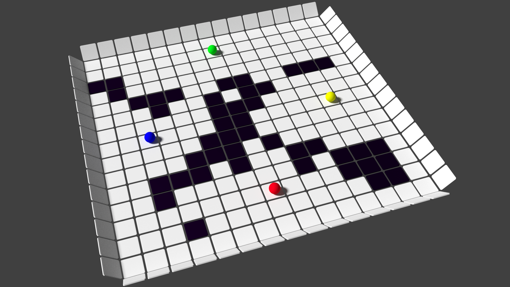
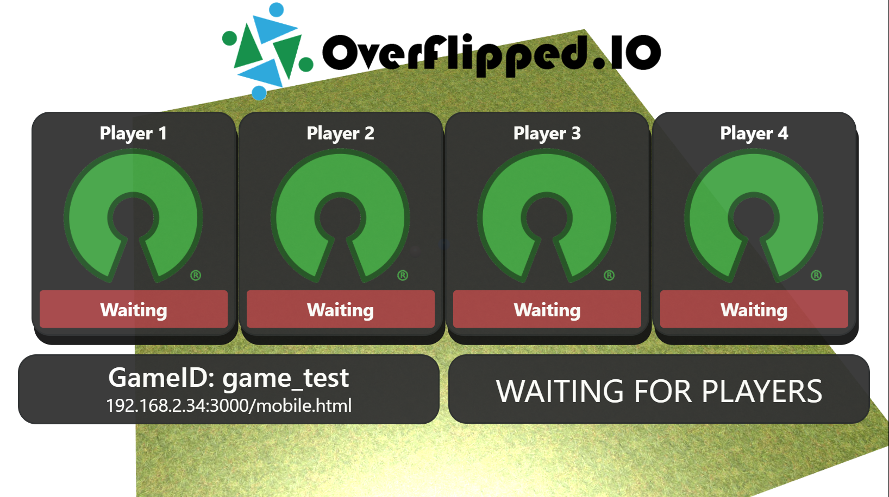
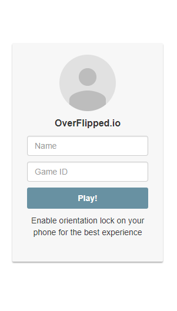

# Welcome To OverFlippedIO 

## Introduction

Welcome to OverFlippedIO, a competitive multiplayer party game that anyone can play with your phone as the controller. 

Currently Under Development

## Development

### Getting Started 

1. To get started with development ensure you have [node.js](https://nodejs.org/en/) installed from the link. 
2. Clone the github repo: `git clone https://github.com/M-Anwar/OverFlippedIO.git`
3. Navigate to where you cloned the repo and open up a terminal/cmd
4. Run `npm install` to download all dependancies to the `node_modules` folder
5. Run `npm start`, this should open up a browser window and run a local server with the game ready to play/develop.

### How to Play 

>Note this will be updated as the game is developed

1. Once you have run `npm start` on your computer, a browser window should automatically open up with the lobby screen active, as shown below:

2. Once on the lobby screen, on the bottom left hand corner you should see a box that has the `GameID` and the `Mobile Controller` link.
3. Open your phone and navigate to that link (e.g `192.168.2.34/mobile.html` in the example above) and you should see this:

4. Enter any `Name` and a corresponding `Game ID` for the game you are playing (e.g `game_test`) in the example above. Then click `Play!`
5. You should be entered into the game and an update should happen on the lobby indicating so. 
6. In the controller view click `ready` and the game should start counting down 
>Note: For DEBUG purposes only a single player is required to enter the game. This can be changed in the `playerManager.js` file. Furthermore, for development, you can navigate to the `/mobileTest.html` endpoint on yor phone to be automatically entered into the lobby for the default `game_test` game.
7. PLAY! *or develop*

## Questions

FAQ should be added somewhere for more info.